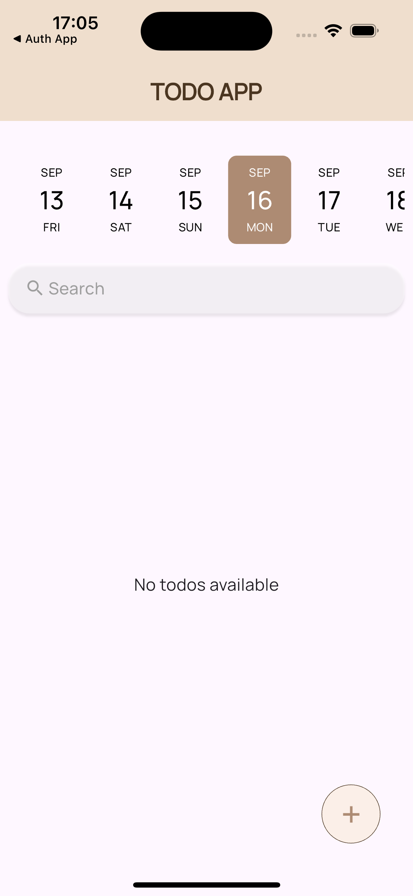
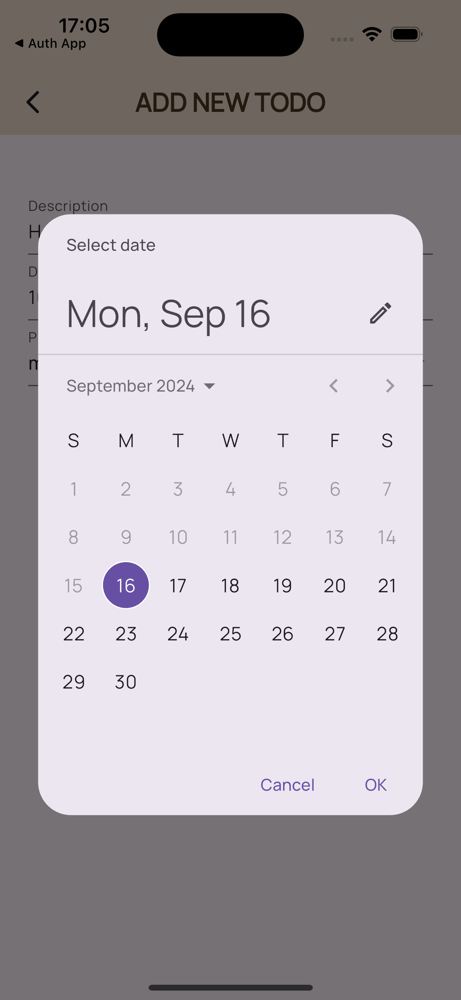
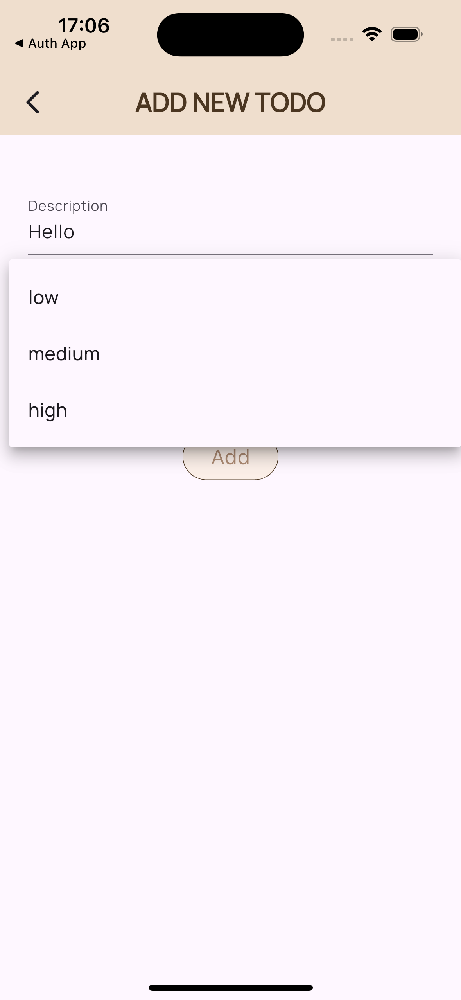
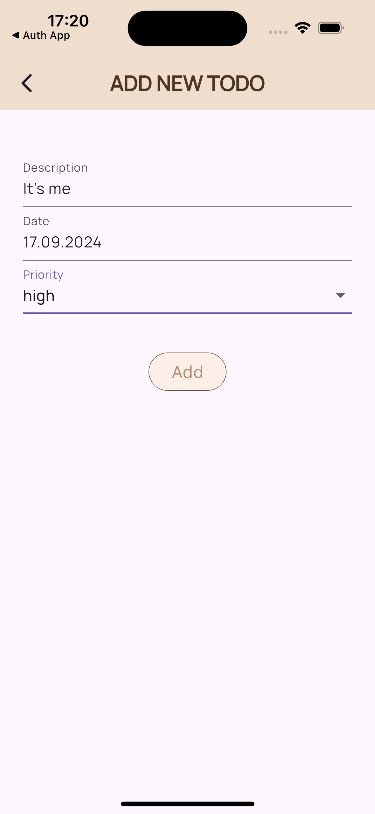
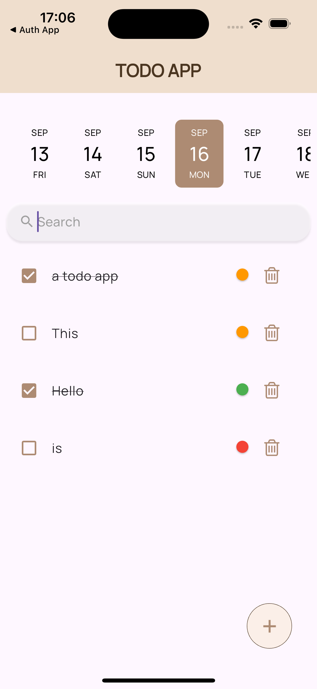

# Firebase Integrated Todo App

A Flutter-based Todo application with Firebase integration that allows users to add, search, delete, and filter their tasks by date efficiently. The app provides an intuitive user interface with features like task prioritization, date selection, and real-time data synchronization using Firebase Firestore.

## Features
### Task Management: 
Create, delete, search and filter tasks.
### Priority Levels: 
Assign priority levels (low, medium, high) to tasks for better organization.
### Date Picker and Filtering: 
Select and filter tasks by specific dates to enhance scheduling and planning.
### Firebase Integration: 
Store, update, and retrieve tasks in real-time using Firebase Firestore.

## Technologies Used
### Flutter: 
Cross-platform UI toolkit for building natively compiled applications.
### Firebase Firestore: 
Real-time database to store and manage tasks.
### GetX: 
State management and routing in Flutter.

## Learning Outcomes
- Learned to integrate Firebase Firestore with a Flutter application for real-time data management.
- Gained experience with Flutter UI components.
- Improved understanding of state management in Flutter using GetX.
- Developed skills in creating a user-friendly and responsive task management application.

## Screenshots

| Home Page | Date Picker | Selecting Priority |
| --- | --- | --- |
|  |  |  |

| Add Page | Todos |
| --- | --- |
|  |  |
